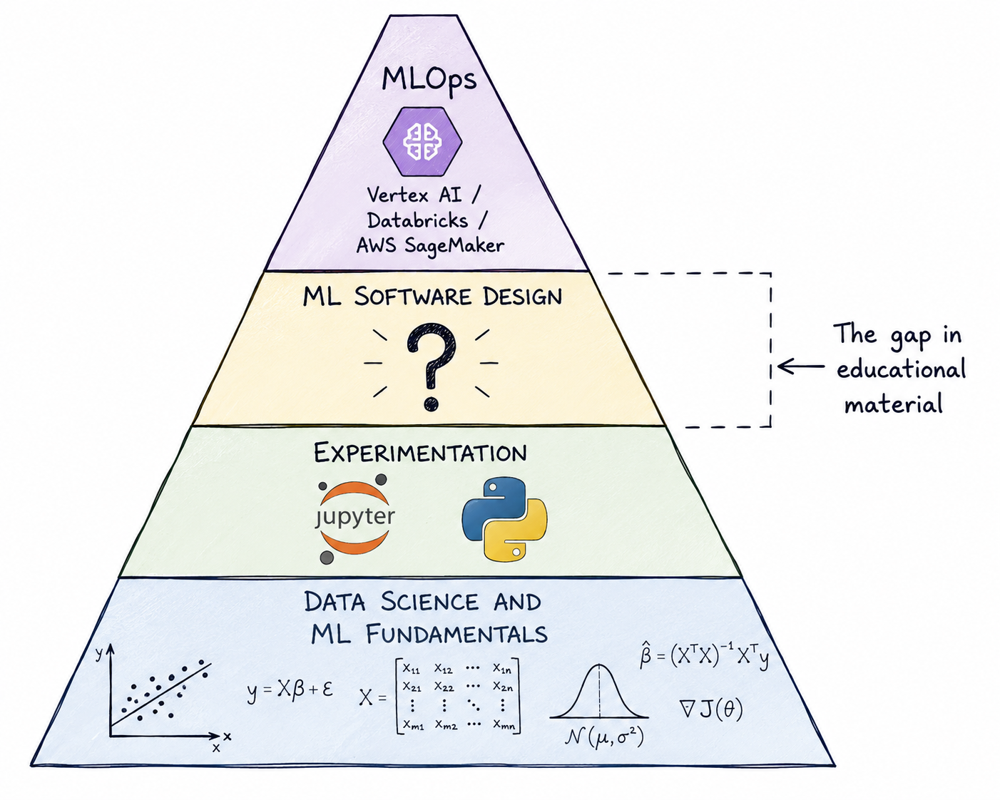
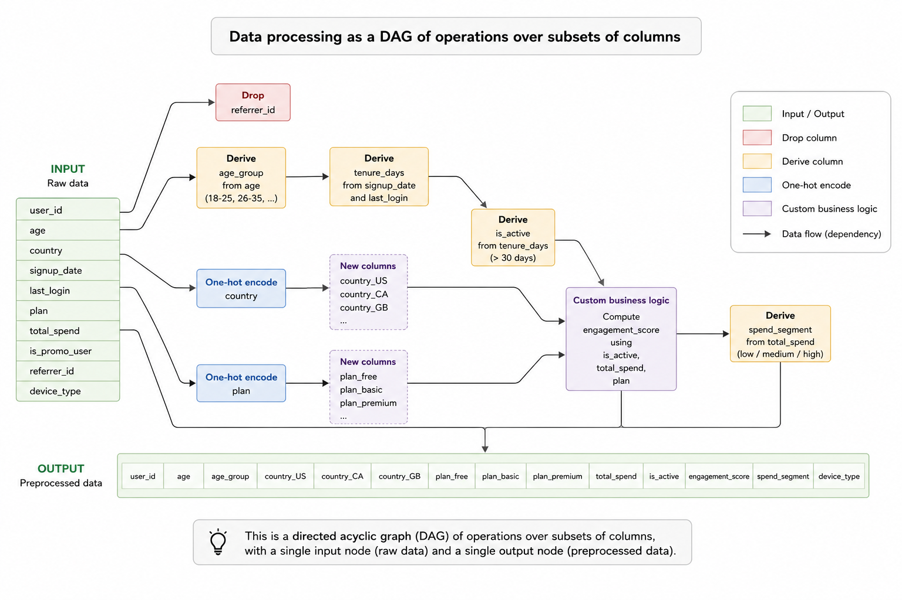
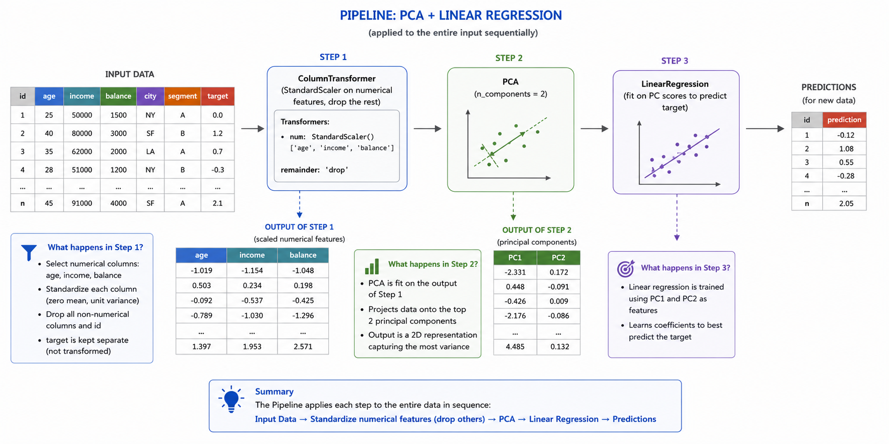
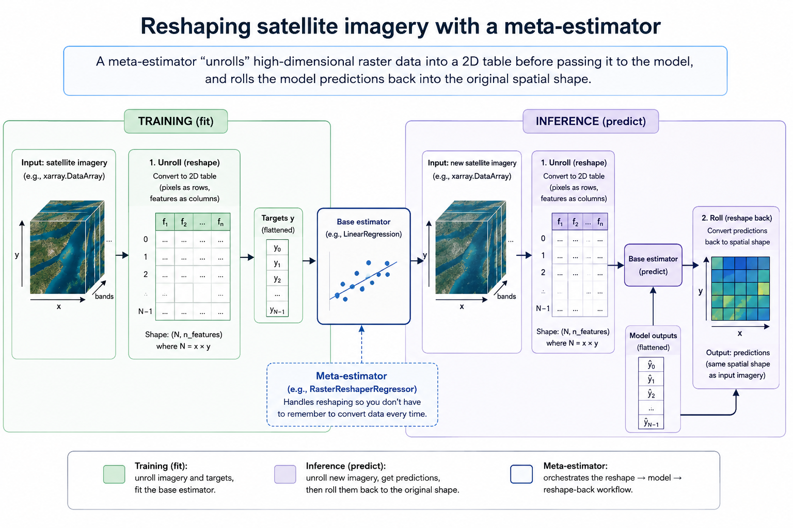

# Motivation

I believe there is a sizable gap in ML training out there. If you want to learn the fundamentals, there are plenty of MSc, PhDs and online courses that will give you a in-depth knowledge of ML, and maybe even some practical experience. If you want to learn DevOps for ML operations, there are several good platforms where you can practice it. But what about in between? Data Science courses tend to finish when they teach you to fit and evaluate a complex model in a Jupyter notebook. ML Engineering courses tend to start when you already have something ready to deploy. But the gulf between those two points can be huge. 




Throughout my career, I have consistently found that this gap is where a lot of projects get stuck. Some examples of this problem:


* A team can run model training just fine but the deployment process is manual and error-prone, and it is passed by word of mouth from one team member to another

* Or, it is all automated but changing *anything* in the pipeline is impossible because components are scattered and tightly coupled. 

The above situations have knock on effects too: new data batches break the code all the time, testing new approaches take too long, results are unreliable and often retracted, explaining changes in performance becomes very hard, and so on.

In this and the following couple posts I'll share what has worked for me in the past to bridge the gap between Data Science and MLOps.


# The ML building blocks

If you are a Data Scientist you have probably used `scikit-learn` before. It is *the* library for classic ML in Python, and implements a wide range of learning algorithms and related utilities. 

This chapter looks at the problems `scikit-learn` solves from the point of view of software design. 

Bridging the gap between experimentation and deployment is often referred to as *productionising the model*, *bringing it to production* and similar variants. There is an element of truth to that: you are trying to turn your results into a product. What does that even mean? Think of any product you buy online, say, a speaker.

As a consumer, you would expect at the very least that

* The speaker plugs into a typical electrical socket and works on the typical bluetooth connection. It is standardised.

* You do not need to worry about how it actually works under the hood. It just does.

* It works the same in your home or your friend's home. It is reliable.

Deploying a model is no different: your model is the product, and downstream systems (i.e. the ones that will interact with it in the wild) are its consumers. if you release a defective product, you are going to have a lot of angry customers.

Standardisation, portability and extensibility are, roughly, the challenges that `scikit-learn` helps you solve for ML projects. It does so through a combination of object-oriented interfaces and crucial abstractions developed through more than 20 years.


## Transformers: The data processing blocks

Scikit-learn is a lot more than a bunch of off-the-shelf learning algorithms. I would argue that the most powerful object in the library is not its long list of regressors and classifiers, but the conventions that define what all of these objects actually do, and how they do it.

If you go to the project's source code you'll soon realise that most objects in the library inherit from a handful of base classes, such as `BaseEstimator`, `TransformerMixin`, `RegressorMixin`, and so on. In `scikit-learn`, an estimator, regressor, classifier, transformer, and so on, are precisely defined by their corresponding base classes. But what is the deal with classes and interfaces anyway? It is worth spending a couple minutes thinking about what this means.


Let's think for a minute about what exactly a data processing pipeline is in the context of ML. Intuitively speaking, it is the process of turning raw data (whatever that means) into data ready for the model to consume. So we know both the inputs and outputs of a processing pipeline have to be "data". Let's narrow it down and assume "data" is a `DataFrame` (although the library also works with Numpy arrays and occasionally sparse matrices).

So data processing is, roughly, a function  with signature
```py
def data_processing(raw_data: pd.DataFrame) -> pd.DataFrame
```


As for types and shapes, we could argue that since most ML models can only handle numerical data, the output types must be a subclass of `np.number`. For the shapes, we can hardly place any restrictions as there are valid reasons why you would resize the data:

* **Feature engineering**: You may want to create new features from raw columns

* **One-hot encoding**: One-hot encoding creates one extra column in your data per unique category

* **feature selection**: The purpose of feature selection algorithms is to drop unimportant columns before model training.

So it is entirely possible you don't know the width of the final, model-ready data set in advance, even though you know the series of steps you want to apply, and that's ok.

> **_NOTE:_** What about row count? we could argue that filtering is a valid data processing operation, and in most contexts that might be true, but `scikit-learn` draws the line here and **requires transfromations to always preserve the number of rows**.
Why? in ML, a lot of the time you need to compare outputs against true values, i.e. `y-true - y_pred`, for example when computing a metric or as part of iterative learning algorithms. If you cannot guarantee that outputs are of the same length, this operation is not well defined and you suddenly will have lots of errors in your code.

That would be about it if it wasn't for the fact that many common processing steps are learnable, e.g. a one-hot encoder has to first look at category data so that it knows the category set. This means processing steps need to hold some state (i.e. the fitted parameters), which means plain functions are not fit for purpose as they can't do the latter. So, we instead move to classes, which are, in a few words, a bunch of stateful functions. During traning, the object looks at training data, updates its internal state, and returns itself. During data processing, it implements the signature specified above. 

```py
from sklearn.base import TransformerMixin

class DataTransformation(TransformerMixin):

    def __init__(self):
        # save parameters
        pass

    def fit(self, X: pd.DataFrame) -> self:
        # fit the model
        return self

    def transform(self, X: pd.DataFrame) -> pd.DataFrame
        # transform data
        return X
```

If a processing transformation does not have learnable parameters, it can just do nothing inside `fit`. 
This is the minimum interface you need to implement a valid transformer. By inheriting from `TransformerMixin` you make sure your objects already come with some handy side logic you don't have to write yourself, such as metadata routing.

Many common strategies in ML fit the definition of a transformer:

* Data imputation

* Dimensionality reduction

* Feature selection

* Feature engineering


Moreover, in many ML projects, most of the time is spent getting the data processing right.

### Composing processing steps

In real life, data processing usually involves several, probably interdependent, transformations, (e.g. one step creates a column that is used in another step downstream). Usually you will at least want to:

* Drop columns according to some hard rules

* Derive columns from existing ones

* One-hot encode specific columns

* Apply custom business logic

What you have in the general case is (without being super rigurous here) sort of a [directed acyclic graph](https://en.wikipedia.org/wiki/Directed_acyclic_graph) (DAG) of operations over subsets of columns, with the constraint that there is a single input and output nodes (i.e. the pre and post processed data).



The good news though, is that a DAG like this also fits the transformer interface above! Even better, `scikit-learn` provides two crucial pieces that let us build any processing DAG we need.


#### ColumnTransformer, the splitter and joiner

The `ColumnTransformer` class lets you map different column subsets to different transformations. It concatenates all the results into a single, final output DataFrame (or array).


If you look at the documentation you'll see it receives a list of triplets as inputs. Each triple has a custom step name (for your convenience), a transformation to apply, and a list of column names.

You can pass your transformations in a few different formats:

* As transformer instances

* as strings: `'drop'` and `'passthrough'` will cause columns to be dropped or passed as they are, respectively

* If you want to pass a function, you can wrap it in a [FunctionTransformer](https://scikit-learn.org/stable/modules/generated/sklearn.preprocessing.FunctionTransformer.html) and pass it that way

You don't need to cover all of your column names. If you leave some out, the `remainder` parameter determines if they are dropped or passed through. You can even choose columns dynamically based on naming patterns and data types by using [make_column_selector](https://scikit-learn.org/stable/modules/generated/sklearn.compose.make_column_selector.html).

This is what the image above looks like in Python:

```py
from sklearn.preprocessing import (
    StandardScaler, 
    OneHotEncoder,
    FunctionTransformer,
)
from sklearn.compose import ColumnTransformer

data_preproc = ColumnTransformer(
    transformers = [
        ("scaler", StandardScaler(), ["age"]),
        ("ohe", OneHotEncoder(), ["gender", "city"]),
        ("signup_date", FunctionTransformer(get_days_since_signup), ["signup_date"]),
    ],
    remainder="passthrough",
)
```

`ColumnTransformer` is a powerful and flexible abstraction. Most of the time, data processing logic can be factored into some combination of `ColumnTransformer` and `Pipeline` objects.


#### pipelines, the conveyor belt

A [Pipeline](https://scikit-learn.org/stable/modules/generated/sklearn.pipeline.Pipeline.html) lets you chain up transformations. It receives a list of tuples with a custom step name (for your convenience) and a transformation to apply. Steps are applied sequentially; note that unlike `ColumnTransformer`, the steps are applied to the entire input rather than a subset of columns. 

You'll often find that complex transformations build on top of the outputs of other transformations, and complex business logic usually requires multiple chained processing steps. Pipelines shine in those cases.

Pipelines are also powerful for another reason: they let you place a prediction model on top of it (i.e. as its last step). In practice this means they are a convenient wrapper for end-to-end ML processing: regardless of how complex your data processing logic is, and how sophisticated your predictive model is, the whole thing is going to be shaped into a pipeline, and we'll talk later on about why this is such a good thing.


To give you a simple example, imagine you want to perform dimensionality reduction using PCA on your data before passing it to your predictive model. You need to

1. Grab only the numerical features

2. Standardise them

3. Apply PCA

4. Fit or predict from your predictive model

Steps 1 and 2 can be done in one go by a `ColumnTransformer`, but you still have to fit your PCA and predictive models. We can use a `Pipeline` to chain them up:


```py
from sklearn.pipeline import Pipeline
from sklearn.preprocessing import (
    StandardScaler, 
    FunctionTransformer,
)
from sklearn.decomposition import PCA
from sklearn.linear_model import LinearRegression
from sklearn.compose import ColumnTransformer
from sklearn.compose import make_column_selector


pipeline = Pipeline(
    steps=[
        (
            "normaliser", 
            ColumnTransformer(
                transformers = [
                    (
                        "scaler", 
                        StandardScaler(), 
                        make_column_selector(dtype_include=[np.number])
                    )
                ],
                remainder="drop",
            )
        ),
        (
            "PCA",
            PCA(n_components=2)
        ),
        (
            "model",
            LinearRegression()
        ),
    ]
)

```

The code above might seem long at first glance, but the structure is simple: a list of steps, the first of which is a `ColumnTransformer` that rescales numerical data. The second one is PCA dimensionality reducer, and the last step is a linear regression model. The image below provides a more visual explanation.



## Why use transformers?

If you are new to transformers and pipelines you might wonder why you should bother using them or refactoring your existing code to fit into these patterns. After all, your code might already work just fine.

I would encourage using them if you ever foresee your code being run:

* By another person

* In a different computer

* By yourself in the distant future

If you intend to ever deploy your model (i.e., running it reliably on demand, on a different computer), all of them are likely true. 

Say you have trained and saved your model, relying on a collection of loose functions to process your data. The moment you intend to deploy your model you will need to solve a few additional issues.

### The environment problem


First, you have to make your data processing functions available in your deployment environment. Second, you need to use them in the exact same way you did during model training, or risk [train-test skew](https://dswok.com/General-ML/Training-serving-skew#skew-distribution-shift-and-concept-drift). 

If your team has ML or MLOps engineers, they won't be pleased when you tell them *"here are these other Python files you need to include with the model, and here's a code block you have to run every time you call it"*. Depending on the platform you intend to deploy to, shipping bespoke code along with your saved model may not even be possible! from these platform's point of view, your ML object should be a black box that just works.

### The context problem

Other people may not know that separate preprocessing logic exists and have to be run in a specific way as part of your modelling pipeline. This extra context is bound to cause headaches in your team, from errors preventing them from using the model, to developers coming up with their own interpretation of the processing logic in order to fix the problem, and silently producing different results. This is an unnecessary risk.

### The maintenance problem

Even if you are able to ship bespoke code along with your saved model, there is now the problem of code duplication. You will have a copy of your processing logic in your machine, and another one on a remote server. This means that every time you update your processing logic, you have to remember to implement the changes in the deployment environment too. Moreover, you will possibly have to keep track of which version of the preproc logic was used in a given model run. This can make auditing results harder.

### How do these building blocks help?

Environment, context and maintenance: three separate problems, all stemming from the same root cause, keeping your processing logic separate from your model. By using estimators, pipelines and transformers in your work, your end-to-end ML pipeline will be encapsulated as a `Pipeline` instance, regardless of how complex the internal logic may be. Thanks to scikit-learn's base classes, this object can already be easily loaded, saved and serialised: in other words, the object saved in your local machine can be instantly reused in any other machine, and will produce the same results. Because it includes preprocessing logic, all anyone needs to do in order to use the model is calling `pipeline.predict(X)`. They don't have to worry about any extra piece of context.

Moreover, updates to the processing logic are now encapsulated as versioned pipeline files, which is a lot easier to track and avoids code duplication.

## Meta-estimators: add-ons for ML pipelines 

A meta-estimator in scikit-learn  is an estimator that takes another estimator(s) as an input parameter. There are several useful things you can do with a pattern like this, for example, [performing grid search](https://scikit-learn.org/stable/modules/generated/sklearn.model_selection.GridSearchCV.html) and [bagging multiple models](https://scikit-learn.org/stable/modules/generated/sklearn.ensemble.BaggingClassifier.html).

### Manipulating inputs and outputs
At its core, one of the reasons why meta-estimators are a powerful abstraction is because they can modify what goes in and what comes out the model they contain. The clearest illustration of this is the [TransformedTargetRegressor](https://scikit-learn.org/stable/modules/generated/sklearn.compose.TransformedTargetRegressor.html), which applies a transformation to the targets during training and inference. Think of the usual trick in linear regression of fitting a model to $\log(y)$ rather than $y$. This is a popular technique for addressing problems of [heteroscedasticity](https://en.wikipedia.org/wiki/Homoscedasticity_and_heteroscedasticity), yet without a meta-estimator like this you would need to remember to transform your targets back to original scale every single time. Instead, you can achieve this in the following way:

```py
from sklearn.compose import TransformedTargetRegressor
from sklearn.linear_model import LinearRegression

import numpy as np

log_model = TransformedTargetRegressor(
    estimator=LinearRegression(),
    func=np.log,
    inverse_func=np.exp,
)
```

This model:

1. Applies `np.log` to `y` before training
2. During inference, it applies `np.exp` to model outputs

If you are familiar with [function decorators](https://realpython.com/primer-on-python-decorators/), you'll realise this is similar to what they do: they augment an exiting function in some way by accessing their inputs and outputs. 

#### Practical example: reshaping satellite imagery inputs

During a project I was involved in, models were trained on batches of satellite imagery. Geospatial raster data is usually stored as high-dimensional arrays in formats like [xarray](https://docs.xarray.dev/en/stable/). While for classic ML models it is possible to transform it to tabular format before inference, and back into an array after it, this approach carries the same drawbacks as having to remember to apply the conversion every time you use the model.

A custom meta-estimator that "unrolls" the array into a table format before passing it to the model, and rolls the model predictions back into the right shape, is a better long term solution, and overall allowed much quicker experimentation.




### Manipulating the model itself

Another powerful use of meta-estimators is manipulating the core fitted model itself. This is really what [GridSearchCV](https://scikit-learn.org/stable/modules/generated/sklearn.model_selection.GridSearchCV.html) does, for example: it clones the base estimator and validates it on different combination of hyperparameters, returning the best model according to the chosen metric.

#### Example: ONNX conversion

Due to certain incompatibilities across operating systems, In a previous project I needed to translate the model into a cross compatible object using ONNX. 

Again, this is easily done using the meta-estimator abstraction. There were several edge cases that the wrapper needed to handle, for example, if the fitted model did not have an available translation, the wrapper should fall back to the original fitted object. If the model had an available translation however, it was compiled. The wrapper also handled the rather quirky code block for producing inference outputs in ONNX, and hid it under a more familiar `predict` interface. 

Overall this helped fix a problem that up until then was slowing Data Scientists when training a model in different machines.


## Why use meta-estimators?

Meta-estimators are a crucial abstraction for implementing custom blocks of business logic without disrupting the standard ML pipeline interface that is expected in virtually all MLOps libraries nowadays.

Every project and every company has its quirks and its corner cases, like the ones I mentioned above. Meta-estimators allow us to make these bespoke blocks completely transparent to your ML system's clients.

## Closing remarks

Transformers, pipelines and meta-estimators give us the scaffolding to turn modelling code into something standardised, portable and extensible. In the next post, I'll share some interesting meta-estimator examples I've encountered that solve relatively common problems.