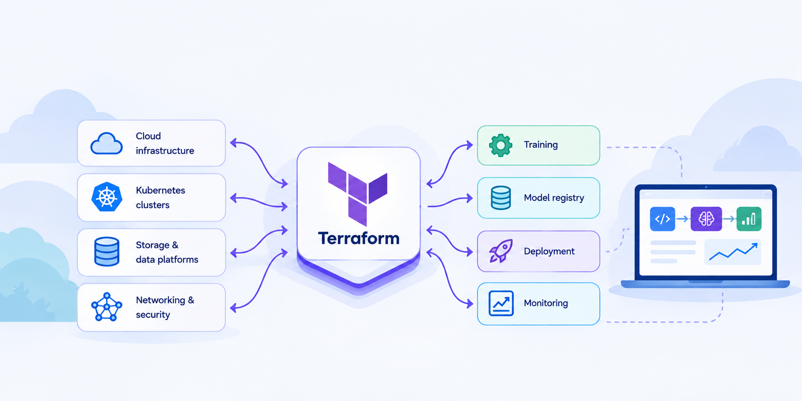
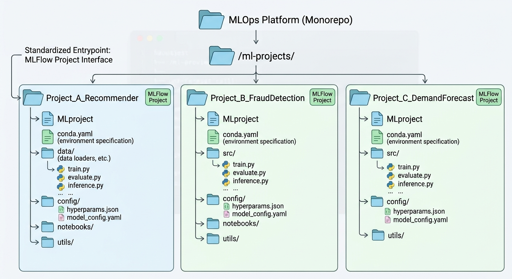
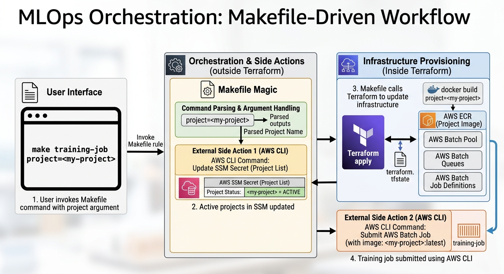

The typical ML pipeline's lifecycle consists of model training, registration, deployment, monitoring and decomisioning. All of these steps are typically reflected as changes in infrastructure, if nothing else because they all usually run on the cloud: even if scale doesn't force you to do this, legal constraints around data usually will.

So it stands to reason that Terraform could orchestrate all of it, at least in principle. But what would it look like, and is it a good idea?

I tinkered with this a few years back and went as far as a creating a [minimal working prototype](https://github.com/nestorSag/mlops-lite), on which most of this post is based. It wasn't all frictionless, but overall it was surprisingly simple and self-contained. Although I haven't deployed it in a real project, I reckon it could work well for some teams.

Throughout this post, I'll assume for simplicity that AWS is the main cloud provider, so some familiarity with AWS services is assumed. Here is how I think it would work.

# First design choice: MLOps monorepo

Because an MLOps platform can be managing multiple independent ML projects, we need a folder, say `ml-projects`, where each project has their own subfolder. For simplicity, let's assume each of these subfolders implements the [MLFlow Project interface](https://mlflow.org/docs/latest/ml/projects/) so that it can be easily run by any orchestrator that sits on the layer above it, without any knowledge of its internals. But note any other simple entrypoint such as Makefile will also work.

This means each subfolder is a full-fledged ML project in its own right and contains its custom data loaders and transformers, the project's configuration, and maybe even environment managers. Ultimately, this requires a monorepo as the central MLOps platform, where every deployed ML project is tracked and maintained. Different teams of Data Scientists work on their own project's folder, while MLOps engineers work on the layer above, at the repo level.




While proofs of concept can be tracked in other repos, once a model is productionised it has to necessarily be migrated to this repo for centralised management. This will be particularly relevant when talking about lifecycle management.

# Second design choice: MLFlow model registry

While Terraform can orchestrate, we still need a model registry, so MLFLow is a central part of this set up. AWS SageMaker offers a fully managed MLFlow server, but if you want to save some money you could also manage it through Terraform. For completeness, the image below shows the infra you would need to spin it up if you do the latter. Back then I wrote a [small public Terraform module](https://github.com/nestorSag/terraform-aws-mlflow-server) to do this, but there are probably much more up to date modules out there.


# Operations

The operations in this system map neatly to Terraform modules that create the necessary infrastructure for running training or inference jobs. While there are certain actions that need to happen external to Terraform for tracking other state, the vast majority of the work here is done through `terraform apply` under the hood.

## Terraform training job module

Training a model on the cloud typically involves containerising the model's project (we are assuming an [MLFlow Project](https://mlflow.org/docs/latest/ml/projects/), for simplicity's sake) and launching a batch compute job with the resulting image. While hardware requirements might vary from project to project, at system level the design below is usually sufficient:

1. Creation of a dedicated project's ECR, 

2. Creation and upload of the corresponding ML Project image to it

3. Creation of a batch compute environment in Fargate, along with queues and task definitions

4. The subsequent submission of a batch job based on the created tasks definition

The end result would be a new MLFlow run containing the fitted model's artifact. Note again that it is the responsability of the corresponding ML Project to load the data, fit the model and log it to the MLFLow server, though the latter's URI can be passed by the orchestrator.


### Tracking project versions

While Terraform can track the state of infrastructure, it cannot track the state of local files, not out of the box at least. But ideally, we want Terraform updates to pick up modifications to the repo's ML folders, in which case, whenever a training job is run, a new image version needs to be uploaded and tagged as `latest` automatically; otherwise no new image should be built. This can be addressed by creating a Terraform `local` variable that maps ML folders to a hash signature, that way any code change would be picked up by Terraform. It can also orchestrate image build and upload by creating a null `Docker build` resource tied to the project hash.

### Tracking active projects

Once we tie Terraform state to local ML folders we have to make a distinction between an ML folder and an active ML project. Imagine we decomission a specific ML project and need to destroy the training infrastructure. If the folder hash is the only reflection of the ML project in Terraform's state, we would need to delete the folder in order to remove its infrastructure which is, not ideal. A better solution is the creation of persistent cloud state for active ML projects. This can be achieved through a ASM secret that is updated every time a project goes online or offline. Terraform would then look at it (as a `data` variable) when updating infrastructure.

## Deployment and monitoring jobs module

For this post I'll assume deployment means a live inference endpoint, but batch inference would also be possible, and even simpler. For live inference, the workflow would be as follows:

1. Create an ECR repo for the project's containerised models

2. Continerise a specific model from the MLFlow Registry (this can happen locally) and upload it to its ECR

3. Create an AWS SageMaker endpoint where the model is to be deployed, and tie it to its container image

4. Create CloudWatch dashboards to track endpoint metrics, as well as model and data metrics


The deployment logic would check for [active projects in ASM](##tracking-active-projects), and throw an error if the deployement job references a project which hasn't been trained before.

## Release and decomissioning

Model decomissioning would be as simple as destroying the infrastructure corresponding to a deployment, while model release would involve uploading a new image to ECR and redeploying, which can be fully managed by Terraform. Both operations are deeply tied to tracking model versions and active projects, discussed above.

# Orchestration

While Terraform does the majority of the job in the set up above, there are other things that need to happen outside it, such as submitting training jobs (done through AWS CLI). A humble Makefile can sit on top of Terraform as the entrypoint for Engineers, keeping track of dependent tasks, and also taking care of these external side actions. 

A little bit of Makefile magic goes a long way. For example, rules can be set up so that users pass information as named arguments, e.g. `project=<project-name>`. The end result is a minimalist but highly intuitive Makefile that can do MLOps based on commands like.

```
make training-job project=<project-name>
```

which would then create the infra if necessary and submit the job, and analogously for deployment. Overall, the call stack would look like 

1. A user invokes a make rule, e.g. `make training-job project=<my-project>`

2. The list of active projects in ASM is updated based on the referenced project.

3. `terraform apply` is called, creating a batch pool, queues and job definitions if necessary, as well as an ECR and the project's image

4. A training job is submitted using the AWS CLI




# Lifecycle management

Tracking project versions like suggested above introduces an error mode where uncomitted changes in an ML project can be deployed by accident. This could create headaches and hard-to-trace discrepancies. For this reason, ideally, operations are managed as GitHub Actions workflows, even if manually triggered, rather than launched from a work laptop.

# Complexity grows

The system described above is sufficient for a small or medium team with basic MLOps requirements, but things can get more complicated once multiple ML projects are managed.

## Project-specific infrastructure

## More sophisticated monitoring needs

## Shadow deployments

## Terraform bugs

# Pros and cons

Personally I really like this set up. It can do a lot with vey little, in terms of set up and dependencies, while giving Data Scientists full freedom to structure their projects as they see fit, as long as they implement an agreed upon entrypoint. It also gives MLOps engineer a centralised control plane for all ML projects.

On the other hand, whether this system is a good fit depends a lot on the team's particular needs. For teams without dedicated MLE or MLOps Engineers, expecting Data Scientists to manage Terraform projects might be pushing it, and for companies with legacy infrastructure footprints where ML needs to be integrated, managing the interactions between ML and non-ML infrastructure could prove difficult.
